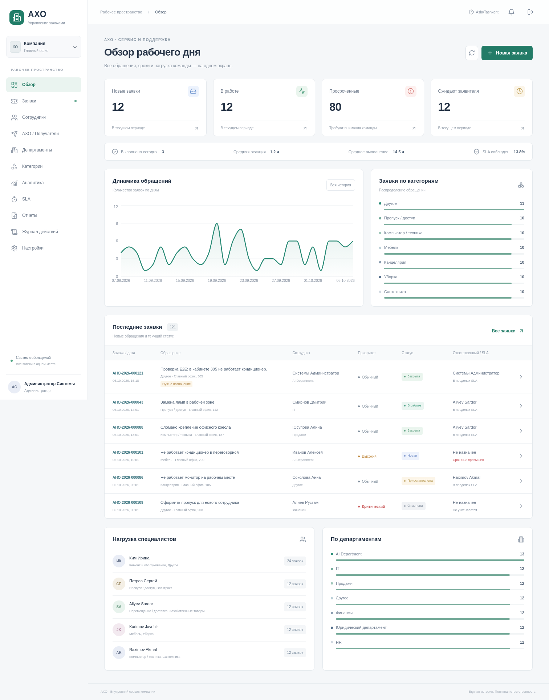

# АХО — внутренний сервис заявок

Рабочий прототип административно-хозяйственного сервиса: React-панель, FastAPI, PostgreSQL, aiogram 3 и фоновая очередь Telegram-уведомлений. Все компоненты используют одну базу и общие бизнес-правила.



## Что реализовано

- Регистрация сотрудника в Telegram с подтверждением данных и одобрением администратора; режимы `ADMIN_APPROVAL`, `WHITELIST`, `OPEN`.
- Создание заявки через бот или веб с предварительным просмотром, категориями, местом, запрошенной срочностью и вложениями Telegram.
- Явные действия над заявкой: принятие, назначение, работа, ожидание, завершение, подтверждение, переоткрытие, отмена и оценка.
- RBAC: сотрудник, специалист АХО, руководитель АХО, администратор. Сотрудник видит только свои обращения; внутренние сообщения доступны АХО.
- Получатели АХО: одноразовые ссылки подключения, числовые Telegram user/chat ID, активация, категории many-to-many, доступность и предпочтения уведомлений. Username не является адресом доставки.
- Маршрутизация `CATEGORY`, `BROADCAST_ALL`, `MANAGER_ONLY`, резервные руководители, флаг `ROUTING_REQUIRED`.
- Атомарное принятие заявки: PostgreSQL `SELECT FOR UPDATE`; второй исполнитель не перезаписывает первого. Устаревшие кнопки проверяются сервером.
- Транзакционная очередь уведомлений; отдельный результат каждой доставки; интервалы повторов 30 с / 2 мин / 10 мин; максимум 4 попытки. Блокировка бота записывается в профиль получателя.
- Настраиваемые SLA, пороги 80/100/120%, автозакрытие, история, аудит, аналитика, фильтры и CSV/XLSX.
- Данные для демонстрации: 30 сотрудников, 5 специалистов, 2 руководителя, администратор, 12 категорий и 120 исторических заявок.

## Быстрый запуск через Docker

Требуются Docker Engine с Compose v2 и Python 3 для генерации локальных секретов.

```bash
cd /path/to/git-jouney
./scripts/bootstrap.sh
docker compose up -d --build --wait
```

`bootstrap.sh` создает `.env` с отдельными случайными паролями администратора и демопользователей, а также ключом JWT. Существующий `.env` сохраняется. Значения не включаются в Git.

Адрес веб-приложения: `http://localhost:5173`. API и Swagger: `http://localhost:8000/docs`. Проверки: `/health`, `/health/ready`. Порты Docker привязаны к loopback для локальной разработки.

При старте backend выполняет `alembic upgrade head` и идемпотентный seed. Данные PostgreSQL хранятся в именованном томе `postgres_data`. Команда `docker compose down` останавливает сервисы, сохраняя данные. Не используйте `down -v`, если нужны существующие данные.

Если `TELEGRAM_BOT_TOKEN` пуст, контейнер бота остается запущенным в явно обозначенном режиме ожидания настройки. Это **не подтверждает подключение к Telegram**. Веб, API и база работают независимо; журнал показывает неотправленные уведомления.

### Эта облачная среда

В облачной среде сетевой прокси использует дополнительный доверенный CA, а домашняя директория может быть доступна только для чтения. Для нее предусмотрен отдельный запуск:

```bash
./scripts/start-cloud.sh
```

Он использует `infrastructure/compose.cloud.yml`: CA передается сборке через BuildKit secret и монтируется контейнерам Python только для чтения. Проверка TLS не отключается. `BUILDX_CONFIG` хранится в `/tmp/aho-buildx`. Для обычного Docker без такого прокси дополнительный файл не нужен.

## Локальная разработка

Требуются Python 3.12+, Node.js 22+ и Docker для PostgreSQL.

```bash
./scripts/setup-local.sh
# Терминал 1
cd apps/backend
../../.venv/bin/uvicorn aho.api:app --reload --host 0.0.0.0 --port 8000
# Терминал 2, из корня
npm run dev --prefix apps/admin-web
# Терминал 3, после настройки токена
cd apps/backend
../../.venv/bin/python -m aho.bot
```

Не запускайте локальный API/Vite одновременно с Compose-сервисами на тех же портах. При необходимости сначала остановите `backend`, `telegram-bot`, `admin-web` через Compose, оставив PostgreSQL.

Каждая задача Codex уже изолирована. Используйте существующий checkout; создание дополнительного Git worktree не требуется.

## Демонстрационные учетные записи

| Роль | Логин | Пароль |
|---|---|---|
| Администратор | `admin@example.local` либо `ADMIN_INITIAL_EMAIL` | Значение `ADMIN_INITIAL_PASSWORD` в локальном `.env` |
| Руководитель | `manager@example.local` | Значение `DEMO_PASSWORD` в `.env` |
| Специалист | `specialist@example.local` | Значение `DEMO_PASSWORD` в `.env` |
| Сотрудник | `employee@example.local` | Значение `DEMO_PASSWORD` в `.env` |

Пароли задаются окружением, фиксированных паролей в коде нет. Seed разрешен только при `ENVIRONMENT=development`. Для существующей БД повторный seed не сбрасывает пароли. Демопользователям не присваиваются вымышленные Telegram ID: до подключения доставка в Telegram невозможна. Учетная запись, зарегистрированная только через бот, не получает веб-пароль автоматически.

Для демонстрации без Telegram администратор может создать собственную заявку в панели, принять ее, начать работу, завершить, подтвердить и оценить. Полноценный сценарий с разными ролями и Telegram описан в [docs/demo.md](docs/demo.md).

## Telegram: подключение

1. Создайте бота через BotFather.
2. Запишите настоящий токен в `TELEGRAM_BOT_TOKEN` в локальном `.env` или защищенной переменной окружения. Не отправляйте токен в чат и не добавляйте его в Git. `TELEGRAM_BOT_USERNAME` — имя бота без `@`.
3. Разрешите исходящий HTTPS-доступ к `api.telegram.org`.
4. Пересоздайте контейнер: `docker compose up -d --force-recreate telegram-bot backend`. В облаке используйте также `-f docker-compose.yml -f infrastructure/compose.cloud.yml`.
5. Сотрудник открывает бота, нажимает `/start`, вводит данные и подтверждает их. Администратор одобряет регистрацию в «Сотрудники».
6. Для получателя выберите сотрудника в «АХО / Получатели» → «Добавить получателя». Передайте ему одноразовую ссылку. Срок действия — 7 дней.
7. Специалист открывает ссылку и нажимает Start. Система связывает числовые ID с выбранной учетной записью. После этого администратор активирует получателя, назначает категории и проверяет тестовое уведомление.
8. Результат смотрите в журнале доставки (колокольчик в панели). `SENT` означает принятие сообщения Telegram API; API не предоставляет подтверждения прочтения пользователем.

Бот работает через **long polling**; входящий webhook не нужен. Если у бота уже настроен webhook, polling приостанавливается, чтобы сохранить действующую интеграцию. Только после явного решения перенести бота установите `TELEGRAM_REPLACE_WEBHOOK=true`; тогда прежний webhook будет удален без удаления ожидающих обновлений. Не запускайте два polling-процесса для одного токена. Получателю не требуется ежедневно нажимать Start или держать бот открытым.

Сам по себе `@username` не связывает аккаунты и не разрешает доставку. Для существующей учетной записи используйте приглашение. Если Telegram уже связан с другим внутренним пользователем, система откажет в привязке; автоматического объединения учетных записей нет.

`AHO_TELEGRAM_CHAT_ID` зарезервирован для будущего общего группового канала. Текущий прототип использует персональные чаты утвержденных получателей; произвольная отправка в общий чат не включена.

## Переменные окружения

| Переменная | Назначение |
|---|---|
| `DATABASE_URL` | SQLAlchemy URL PostgreSQL, драйвер `postgresql+psycopg` |
| `POSTGRES_PASSWORD` | Пароль PostgreSQL в локальном Compose; пример `aho` предназначен только для разработки |
| `JWT_SECRET` | Случайный ключ не короче 32 символов; обязателен |
| `ADMIN_INITIAL_EMAIL` | Почта первого демоадминистратора |
| `ADMIN_INITIAL_PASSWORD` | Пароль администратора для seed |
| `DEMO_PASSWORD` | Пароль остальных демоаккаунтов |
| `TELEGRAM_BOT_TOKEN` | Настоящий токен Telegram для aiogram; без него доставка отключена |
| `TELEGRAM_BOT_USERNAME` | Имя бота для формирования ссылок |
| `TELEGRAM_REPLACE_WEBHOOK` | По умолчанию `false`: сохраняет существующий webhook; `true` — явное разрешение переноса на polling |
| `AHO_TELEGRAM_CHAT_ID` | Зарезервировано; текущая доставка — по персональным chat ID |
| `REGISTRATION_MODE` | Начальное значение для новой БД; по умолчанию `ADMIN_APPROVAL` |
| `APP_BASE_URL` | Внешний адрес backend, проверка Origin |
| `FRONTEND_URL` | Разрешенный Origin веб-приложения |
| `LOG_LEVEL` | Уровень журналирования, по умолчанию `INFO` |
| `ENVIRONMENT` | `development`, `testing` или `production`; демо-seed запрещен в production |
| `COOKIE_SECURE` | `true` для HTTPS production; обязательно в production |
| `TEST_DATABASE_URL` | Отдельная БД тестов; имя обязательно заканчивается на `_test` |
| `BUILDX_CONFIG` | Необязательная директория кэша Buildx в облаке |
| `SSL_CERT_FILE` | Дополнительная доверенная цепочка CA при использовании облачного override |

Маршрутизация, правила регистрации, часовой пояс (по умолчанию `Asia/Tashkent`), SLA и автозакрытие хранятся в БД. После первоначального seed изменяйте их через панель; изменение `REGISTRATION_MODE` в `.env` не перезапишет существующую политику организации.

## Проверки

```bash
./scripts/test.sh
```

Тесты используют отдельную PostgreSQL-базу `aho_test` и очищают только ее таблицы. Не направляйте `TEST_DATABASE_URL` на рабочую базу.

Браузерная проверка при запущенном приложении:

```bash
PLAYWRIGHT_BROWSERS_PATH=/tmp/aho-playwright npm exec --prefix apps/admin-web -- playwright install chromium
PLAYWRIGHT_BROWSERS_PATH=/tmp/aho-playwright node apps/admin-web/tests/smoke.mjs
```

Она входит с локальными учетными данными, проверяет разделы, создает реальную тестовую заявку и проходит цикл до оценки 5. Заявка остается в демобазе. Снимки интерфейса записываются в `docs/screenshots/`.

[Результаты проверки и ограничения](docs/validation.md), [архитектура и диаграммы](docs/architecture.md), [перечень API](docs/api.md), [структура проекта](docs/file-tree.md).

## Ограничения прототипа и следующий этап

- Подключение к настоящему Telegram требует токена и реальных участников; офлайн-тесты не доказывают фактическую сетевую доставку.
- Используется одиночный polling-процесс бота. Состояние FSM и outbox сохраняются в PostgreSQL. Разрыв процесса после отправки Telegram, но до фиксации транзакции может привести к повторной доставке: внешняя Bot API не поддерживает exactly-once.
- Внутренние списки/аналитика рассчитаны на небольшой объем: фильтрация SLA и агрегаты выполняются в Python после SQL-выборки. Для больших данных нужны SQL-агрегаты, серверная пагинация до загрузки и индексы по реальному профилю запросов.
- Веб-вложения скачиваются через авторизованный backend; загрузка выполняется через Telegram. Лимит 20 МБ, 10 вложений в мастере. Антивирусной проверки нет.
- Telegram-списки показывают последние 30 заявок, история — до 50 за выбранный период; полная история доступна в веб-панели.
- SLA считается по календарному времени, без праздничных дней и пауз на ожидание материалов. PDF-экспорт не реализован (необязательный пункт).
- Initial migration использует текущие SQLAlchemy metadata. Перед развитием схемы зафиксируйте начальную миграцию явным DDL и добавляйте версионированные изменения Alembic.
- Для production: отдельная инициализация администратора без demo-seed, SSO/MFA, восстановление паролей, управление секретами, HTTPS/Secure cookies, резервные копии и проверка восстановления, ограничения запросов на ingress, централизованные метрики, антивирус файлов, отдельный worker и политика хранения персональных данных. Демонстрационный Compose не является production-конфигурацией.

## Предварительно одобренный получатель по Telegram ID

Оператор может заранее разрешить конкретному числовому Telegram ID принимать обращения:

```bash
docker compose exec backend python -m aho.configure_receiver \
  --telegram-user-id TELEGRAM_USER_ID \
  --first-name FIRST_NAME --last-name LAST_NAME \
  --username USERNAME --all-categories
```

Замените параметры данными получателя. Команда не отправляет сообщений, не назначает chat ID и не выдает полномочия администратора. Она создает/обновляет специалиста и назначает все существующие активные категории. После **личного `/start` с указанного числового ID** подключение завершается автоматически; другой пользователь с похожим username не сможет занять учетную запись. Обычные приглашения сохраняют ручное одобрение. Для новых категорий настройте получателя через панель.

Краткая инструкция на узбекском: [ISHGA_TUSHIRISH.md](ISHGA_TUSHIRISH.md).

## Одобрение регистрации прямо в Telegram

У пользователя с ролью `ADMIN` после `/start` появляется кнопка **👥 Регистрации**. Она открывает ожидающие регистрации с кнопками **✅ Подтвердить** и пагинацией. После подтверждения сотруднику отправляется уведомление через outbox; он нажимает `/start` и получает меню заявителя. Повторное подтверждение устаревшей кнопкой не меняет состояние и не создает повторное уведомление. АХО-специалисты и руководители без роли ADMIN не могут использовать это действие.

Веб-одобрение и Telegram используют один транзакционный сервис `approve_registration`, общие проверки прав и журнал аудита.
