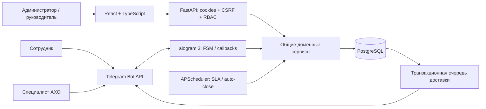
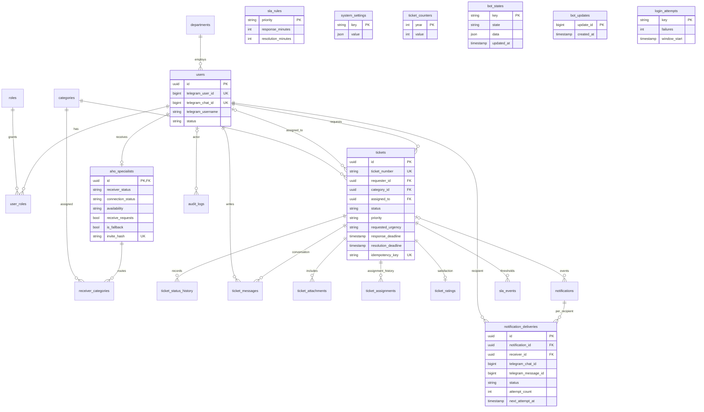
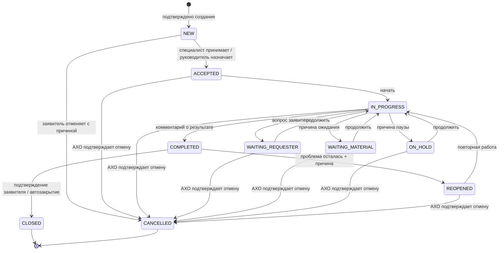

# Архитектура

API, bot и worker используют одни модели и функции `services.py`. HTTP и Telegram только преобразуют ввод; полномочия, переходы, маршрутизация, история и уведомления проверяются в доменном слое. Изменения заявки и добавление outbox-записей происходят в одной транзакции.

## ER-диаграмма

UUID представлены строками длиной 36. Числовые Telegram ID хранятся как `BIGINT`; имена пользователей — только отображаемые данные. В `receiver_categories` составной ключ запрещает повторную связь. Уникальность `(notification_id, receiver_id)` предотвращает дубли внутри события; `(ticket_id, kind)` — повтор SLA-порога. Категории и департаменты архивируются, а не удаляются.

## Жизненный цикл

Заявитель по умолчанию непосредственно отменяет только `NEW`; далее он создает запрос отмены. `ACCEPTED` можно разрешить в настройках. Специалист не подтверждает результат вместо заявителя. Повторное открытие разрешено из `COMPLETED`; `CLOSED` — конечное состояние.

## Транзакции и доставка

- Годовой счетчик номера обновляется атомарным PostgreSQL `INSERT … ON CONFLICT DO UPDATE … RETURNING`.
- `Idempotency-Key` при HTTP-создании заявки связывается с внутренним ID пользователя. Telegram-мастер сохраняет один ключ подтверждения в FSM. Повтор возвращает существующую заявку.
- Операционные действия блокируют строку заявки через `FOR UPDATE OF tickets`; правила проверяются после блокировки.
- Worker выбирает одну запись outbox с `FOR UPDATE SKIP LOCKED`. При сбое транзакция откатывается; сетевые ошибки сохраняются с ограниченным backoff.
- Если Telegram сообщает о блокировке, получатель помечается `BLOCKED`; остальные доставки продолжаются.
- После принятия формируются отдельные события редактирования прежних сообщений. Их неудача не влияет на закрепление заявки.
- FSM хранится в PostgreSQL, устаревшие диалоги удаляются планировщиком. `bot_updates` отсекает повторы успешно обработанных update ID. Транзакции обработки Telegram и внешней отправки не составляют единую распределенную транзакцию; гарантия exactly-once не заявляется.
- Планировщик использует advisory lock, поэтому одновременные экземпляры backend не выполняют один цикл SLA параллельно.

## Безопасность

Argon2 для паролей; JWT в HttpOnly/SameSite=Strict cookie; CSRF-токен для изменяющих HTTP-запросов; проверка Origin при login; ограничение ошибочных попыток входа. Все данные валидируются Pydantic, SQL строится SQLAlchemy, React экранирует текст. Файлы отдаются как attachment с `nosniff`, разрешенные типы и размеры ограничены. Секреты и тела запросов не записываются в структурированные логи. У сервиса нет публичного endpoint, позволяющего выдать себя за Telegram-пользователя.

Предварительное одобрение конкретного числового Telegram ID поддерживается операторской командой `python -m aho.configure_receiver`. Она не назначает chat ID; привязка завершается только на личном `/start` от этого ID. При существующем webhook polling не включается без `TELEGRAM_REPLACE_WEBHOOK=true`. Для исходящего Telegram HTTPS используется окружение proxy/CA через `aho.bot_client.EnvironmentSession`.
